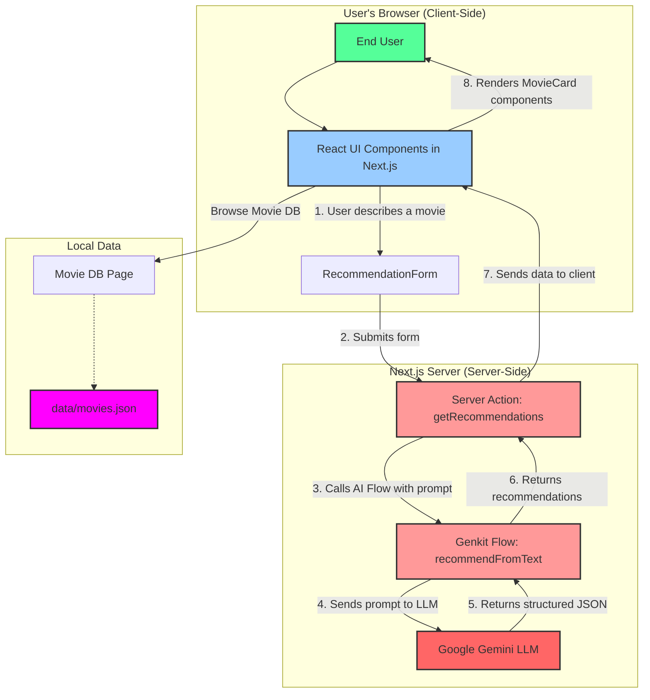

# CineMatic: AI-Powered Movie Recommendations

---

## 1. System Design

### Architecture Overview
- **Frontend Framework:** Next.js (React)
- **Styling:** Tailwind CSS with ShadCN UI components
- **Generative AI:** Google's Gemini models via Genkit
- **Deployment:** Serverless infrastructure

### System Diagram

### Core Components
- **Next.js App Router:** For routing and server-side rendering (SSR).
- **React Server Components (RSC):** To handle data fetching and logic on the server.
- **Genkit Flows:** Server-side functions that interact with the Gemini Large Language Model (LLM) to get movie recommendations.
- **Static JSON Database:** A simple `movies.json` file acts as the local movie database.
- **Admin Panel:** A separate section of the app for managing application data.

---

## 2. How It Works: Implementation Details

### The AI Recommendation Engine (Code Flow)

1.  **User Input (Frontend):**
    - The user interacts with the `RecommendationForm` component on the homepage (`src/app/page.tsx`).
    - They type a description of a movie they want to watch (e.g., "a space movie about saving the world") and optionally select a genre and language.
    - Submitting the form calls the `handleSearch` function.

2.  **Server Action (Backend-ish):**
    - `handleSearch` calls the `getRecommendations` Server Action defined in `src/app/actions.ts`.
    - This server action formats the user's input into a more detailed prompt for the AI.

3.  **Genkit Flow (The AI Core):**
    - The `getRecommendations` action then calls `recommendFromText`, a function from our Genkit flow in `src/ai/flows/recommend-from-text.ts`.
    - This flow is where the magic happens. It takes the text prompt and sends it to the Google Gemini LLM.
    - **Crucially, the prompt instructs the LLM to return its answer in a specific JSON format**, defining properties like `title`, `description`, `poster`, etc. This ensures we get structured, predictable data back from the AI.

4.  **Response and Display (Frontend):**
    - The Genkit flow returns the structured JSON data (a list of recommended movies) back to the Server Action.
    - The action passes this list back to the homepage component.
    - The page then updates its state, and the recommendations are displayed to the user using the `MovieCard` component (`src/components/movie-card.tsx`).

### The Local Movie Database

- The page at `/movies` (`src/app/movies/page.tsx`) directly imports movie data from `src/data/movies.json`.
- It displays each movie using the `LocalMovieCard` component.
- A client-side search feature, powered by a React state hook, allows users to filter the movies by title in real-time.

---

## 3. How to Use the Application

- **Get AI Recommendations:**
    - On the homepage, use the main form to describe the movie you're in the mood for.
    - Use the dropdowns to filter by genre or language for more specific results.
    - Click "Get Recommendations" and the AI will generate a list of movies for you.
- **Browse the Movie DB:**
    - Click on the "Movie DB" link in the header.
    - This takes you to a page listing all the movies in the local `movies.json` file.
    - Use the search bar at the top to filter the list by title.
- **Watch Trailers:**
    - On any movie card (either AI-generated or from the local DB), click "Watch Trailer" to open a modal window and play the movie's trailer.
- **Manage Data (Admin):**
    - Navigate to `/admin` to access the admin panel.
    - From there, you can paste new JSON data to overwrite the `movies.json` file or use the "Augment" tool to generate review summaries with AI.

---

## 4. Key Code Files

- **`src/app/page.tsx`**: The main homepage component. It manages the state for recommendations and handles the user's search request.
- **`src/app/actions.ts`**: Contains the `getRecommendations` server action, which acts as the bridge between the frontend and the AI backend.
- **`src/ai/flows/recommend-from-text.ts`**: The core of the AI feature. This file defines the prompt sent to the Gemini LLM and specifies the exact JSON structure for the response.
- **`src/components/movie-card.tsx`**: The React component responsible for displaying a single AI-recommended movie.
- **`src/data/movies.json`**: The static file that serves as the local database for the "/movies" page.

---

## 5. Result & Analysis

### Key Outcomes
- A fully functional web application that provides personalized movie recommendations.
- A user-friendly interface built with modern, responsive components.
- Successful integration of a Large Language Model (Gemini) to power the core feature.
- A simple but effective local database for displaying a curated movie list.

### Analysis
- The use of Genkit simplifies the interaction with the LLM, allowing for structured inputs and outputs, which is critical for reliability.
- The separation of the AI recommendations and the local movie database allows for two distinct ways for users to discover content.
- The admin panel provides a basic but essential way to manage the app's data without needing to directly edit code.

---

## 6. Limitations

- **Static Database:** The `movies.json` file is static and requires manual updates through the admin panel. It is not a scalable, real-time database.
- **No User Accounts:** The application does not support user profiles, watchlists, or personalized history. Recommendations are session-based.
- **Simple AI Prompts:** The AI recommendation prompt is straightforward. It doesn't consider user history or fine-grained preferences.
- **Video Player:** The trailer player only supports YouTube and Dailymotion. Other video sources require code changes.

---

## 7. Future Scope

- **Integrate a Real-Time Database:** Replace the `movies.json` file with a cloud database like Firestore to allow for dynamic data, user-generated content, and more complex queries.
- **User Authentication:** Add user sign-up and login to enable personalized features like saved watchlists, recommendation history, and ratings.
- **Advanced AI Recommendations:**
    - Implement a "similar movies" feature.
    - Fine-tune the recommendation model based on user ratings and feedback.
    - Use user history to provide more personalized suggestions over time.
- **Expand Content:** Add support for TV shows, documentaries, and other forms of media.
- **Enhanced Admin Tools:** Build more robust tools for managing a larger dataset, including bulk uploads and editing.

---

## 8. Conclusion

CineMatic successfully demonstrates the power of integrating Generative AI into a modern web application. Using Next.js and Genkit, we were able to quickly build a user-friendly movie recommendation engine that provides a dynamic and engaging user experience. While the current implementation has limitations, it establishes a strong foundation that can be expanded with more advanced features like real-time data, user personalization, and more sophisticated AI capabilities.

---

## 9. References

- **Next.js:** [https://nextjs.org/](https://nextjs.org/)
- **React:** [https://react.dev/](https://react.dev/)
- **Tailwind CSS:** [https://tailwindcss.com/](https://tailwindcss.com/)
- **ShadCN UI:** [https://ui.shadcn.com/](https://ui.shadcn.com/)
- **Genkit (for Google AI):** [https://firebase.google.com/docs/genkit](https://firebase.google.com/docs/genkit)
- **Lucide Icons:** [https://lucide.dev/](https://lucide.dev/)
